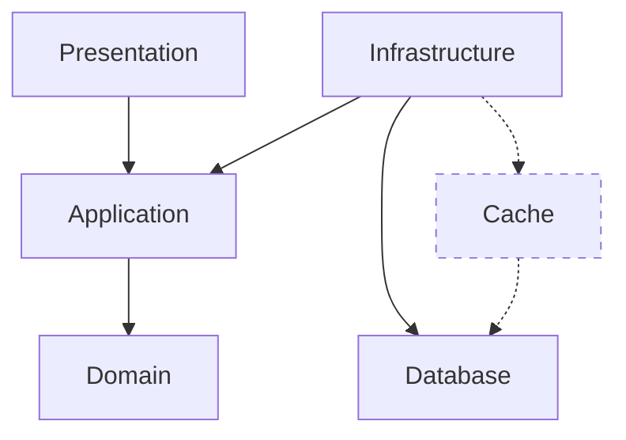

## Back End

For the assessment, I decided to explore the following concepts as an opportunity to leverage what I know, learn and improve.

### Clean Architecture 

Focusing on the following key principles related to clean architecture:

#### Separation of Concerns

Separate our solution into the following layers:

- Presentation - The API is the entry point for communication with the application.
- Application - Business logic specific to the use cases in our application.
- Domain - Entities, value objects and aggregates, and domain-specific services.
- Infrastructure - Implementation details and integration include repositories, database context and external service.

#### Dependency Rule

Inner layers should not depend on outer layers. The direction of dependency should always be towards the Application.

#### Independent of Frameworks

Avoid being tied to any specific framework. Frameworks should be tools, not the foundation of your system.

#### Visual Representation

### Domain Driver Design

> Our Todo application _is not well suited_ for DDD (simple _CRUD_ would have been sufficient), as simple domains lead to an anemic domain model. However, it did provide the opportunity to explore how aggregates can be persistent and rehydrated.

Generally used in modeling complex domains and consists of the following key concepts:

#### Ubiquitous Language

Develop a common language shared by both domain experts and developers.

#### Entities and Value Objects

Entities have an identity and lifecycle, while value objects are immutable and only defined by their attributes.

#### Aggregates and Aggregate Roots:

Aggregates are clusters of domain objects that can be treated as a single unit. The aggregate root is the only member that outside objects can reference.

#### Repositories:

Mechanisms for accessing persisting and rehydrating aggregates.

### Command Query Responsibility Segregation

Implement a simplified version of CQRS separating  read and write operations based on the following key principles:

#### Command Model

Handles create, update, and delete operations (writes).

#### Query Model

Handles read operations.

### Frameworks and Libraries

We have selected the following libraries for our implementation:

|Framework / Library|Description|
|-|-|
| [AutoMapper](https://github.com/AutoMapper/AutoMapper) | A convention-based object-object mapper. |
| [EF Core](https://learn.microsoft.com/en-us/ef/core/) | Entity Framework (EF) Core is a lightweight, extensible, open source and cross-platform version of the popular Entity Framework data access technology. |
| [Fluent Validation](https://github.com/FluentValidation/FluentValidation) | FluentValidation is a .NET library for building strongly-typed validation rules. |
| [MediatR](https://github.com/jbogard/MediatR) | Simple mediator implementation in .NET. In-process messaging with no dependencies. |
| [NSwag](https://learn.microsoft.com/en-us/aspnet/core/tutorials/getting-started-with-nswag?view=aspnetcore-8.0&tabs=visual-studio) | With NSwag, you don't need an existing API—you can use third-party APIs that incorporate Swagger and generate a client implementation. |

### Contract first development

We use a contract-first approach when designing and developing the Todo List API. 

In collaboration with other members of the team, we ensure:

- A documented representation of what we will be building. 
- Allow for early validation that helps identify design issues.
- Contain the endpoints, methods, request and response formats, and expected error codes.
- Ensure we reduce inconsistencies between what we have documented and what we are implementing.
- Engineers in the same or different teams can work in parallel once the contract is defined.
- The front-end and quality assurance engineers can start development against mock servers.
- It provides safety when refactoring, knowing that internal changes do not affect the API interface.
- Improves visibility and the opportunity to identify breaking changes as part of the Pull Request process.
- Generate code for controllers and clients 

> A copy of the [todoitems.openapi.yaml](specs/todoitems.openapi.yaml) can be found in the `specs` folder.

### Contract Tests

We aim to minimise duplication between contract and unit tests, keeping the test pyramid in mind. 

Contract testing ensures that interactions between the front end and back end adhere to our predefined contract, reducing the risks of integration issues. 

During development, it allows the team to detect breaking changes early in the development cycle, improving reliability and increasing the overall stability of our solution. 

>Our main goal is to catch breaking changes early and ensure that the implementation of our API adheres to the contract, as that is what consumers will expect. 

### Code Generation

We generate code for the C# controller and contract test client, ensuring we meet the consumer's expectations when returning responses containing the Todo Items or Problem Details.

> See [Backend Code Generation](specs/back-end) in the `specs/back-end` folder.

The following section reminds us of the considerations that must be made when designing, building, and operating APIs.

## Other considerations

### Security

#### Encryption 

SSL will be offloaded to a load balancer or gateway provided by the cloud provider. The client will then securely communicate over HTTPS while the load balancer or gateway forwards the traffic to the backend container over HTTP. 

#### Authentication and Authorisation

JWTs will be used to secure the Todo List Web API by providing a stateless, compact, and self-contained method for authenticating and authorising users, ensuring only valid tokens can access protected resources. 

JWTs embed user information and permissions within the token, improving scalability, reducing server load, and enhancing security.

#### Scalability
We want to design an API that can handle increasing loads, consider the use of caching and load balancing, and ensure that it can run on scalable infrastructure.

#### Performance
Aim to optimise response times with efficient code, database indexing, and minimising payload sizes.

#### Reliability
Ensure high availability with redundant systems, failover mechanisms, retry mechanisms, and robust error handling.

#### Rate Limiting
Aim to prevent abuse and ensure fair usage by limiting the number of requests a client can make.

#### Monitoring
Implement logging and monitoring to track usage and detect issues.

#### Versioning
Consider using versioning to support changes without disrupting existing clients or ensure that changes are always backward compatible.