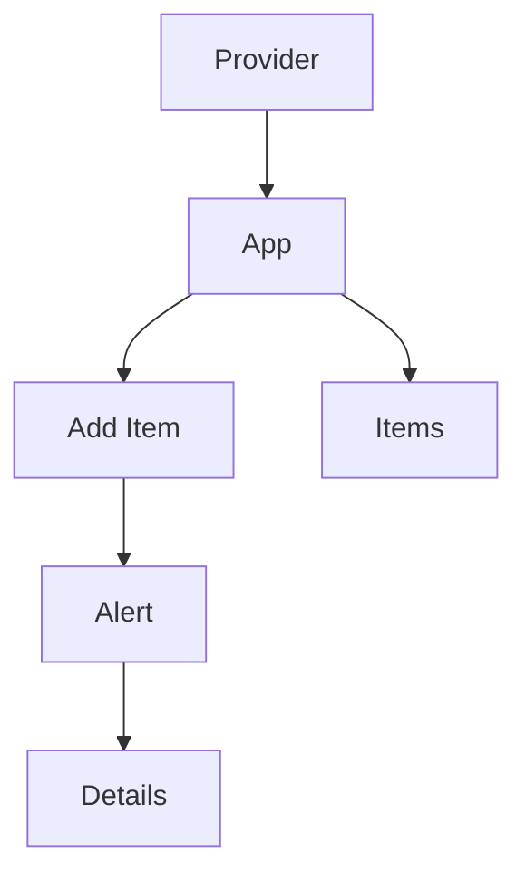

## Front End 

> **Disclaimer:** I have not spent a significant amount of time developing React Applications. In part, this section reflects my time spent learning for this assessment.

### Application Architecture

React Application architecture typically involves a component-based structure. The UI is divided into reusable, self-contained components, sharing context and state via the provider. 

- **Provider** - We wrap the application in a provider so the components have a shared context and state regarding the items. 
- **App** - This component is also our landing page and contains the Item and Items components.
- **Item** - Allows us to add a new todo item. 
- **Items** - Allows us to view a list of todo items that have not been completed.
- **Alerts** - Provides feedback on the actions taken. Allows us to view the Problem Details received from the API.
- **Details** - Provides detailed information regarding the problem.

#### Benefits

- Components are organised in a hierarchical tree, promoting separation of concerns and modularity.
- Data fetching and side effects are handled with hooks like useEffect and the Axios library. 
- Promotes maintainability, scalability, and ease of testing.

#### Visual Representation

### Why TypeScript

TypeScript offers numerous benefits that enhance the codebase's development process and quality. 

By introducing static typing, TypeScript catches errors at compile time, reducing runtime errors and making the code more robust. It provides improved code editor support with features like autocompletion, type checking, and intelligent refactoring, which boost developer productivity and efficiency.

TypeScript enhances code readability and maintainability by enforcing clear type definitions, making it easier to understand and modify the code. This is particularly beneficial in large codebases and collaborative projects, as it ensures consistent coding standards and provides better documentation through type annotations.

TypeScript supports modern JavaScript features and transpiles to plain JavaScript, allowing developers to use the latest language features while maintaining compatibility with older environments. 

It integrates seamlessly with existing JavaScript code, making it easy to adopt TypeScript in a project gradually.

### Static File Hosting

As part of containerising the React Application, I ran into an issue where I could access environment variables during local development but not when the application ran in the container using `serve`.

After researching the issue, I discovered that you cannot access environment variables directly because static files served by `serve` are precompiled and do not get processed by the container at runtime.

This felt somewhat limiting as I wanted to build an immutable artifact that uses environment variables for configuration purposes depending on the environment in which we run the container. 

To resolve this, I settled for a solution I found online e.g. We run a Node Express server and inject the environment variables into the `index.html` page at runtime as a script tag. 

> Side note: I did consider using `.env`, but again, this affects the container's immutability as it needs to be updated at build time.

See the [server.js](src/front-end/server.js) in the `src/front-end` folder.

### Code Generation

We choose to generate code for the client and models we will use when interacting with the API. 

A strongly typed client and its associated functions make it easy to meet API expectations when posting and getting data.

> See [Front End Code Generation](specs/front-end) in the `specs/front-end` folder.

### Frameworks and Libraries

We have selected the following libraries for our implementation:

|Framework / Library|Description|
|-|-|
| [Axios](https://axios-http.com/docs/intro) | Axios is a promise-based HTTP Client for node.js and the browser. |
| [React](https://react.dev/) | The library for web and native user interfaces |
| [React Bootstrap](https://react-bootstrap.github.io/) | The most popular front-end framework, rebuilt for React. |
| [TypeScipt](https://www.typescriptlang.org/) | TypeScript is a strongly typed programming language that builds on JavaScript, giving you better tooling at any scale. |
| [UUID](https://www.npmjs.com/package/uuid) | For the creation of RFC9562 (formally RFC4122) UUIDs |
